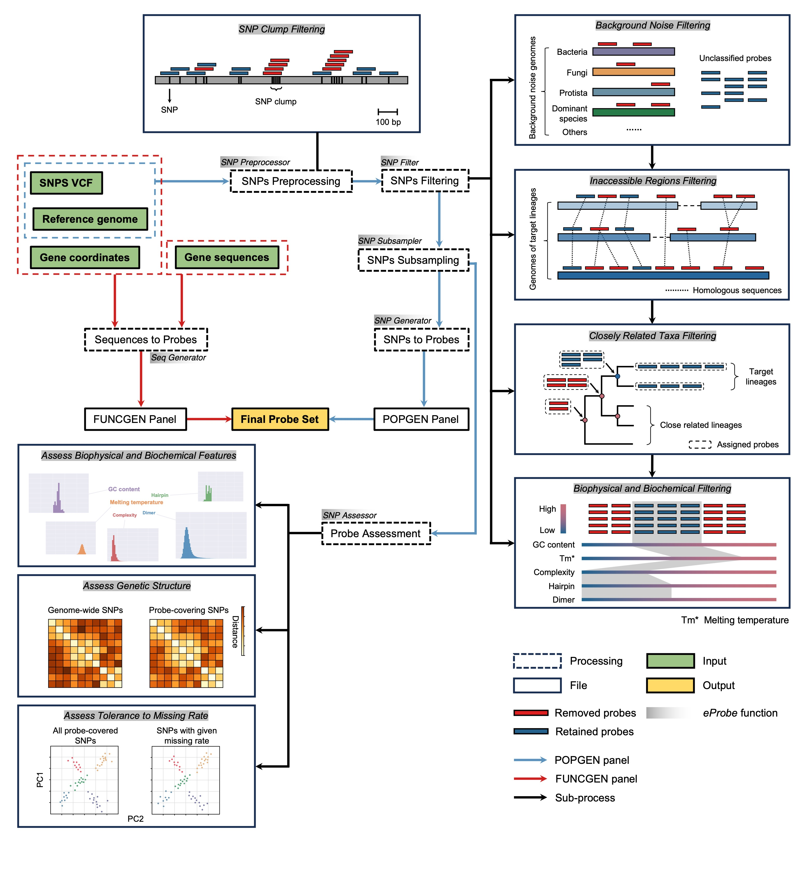
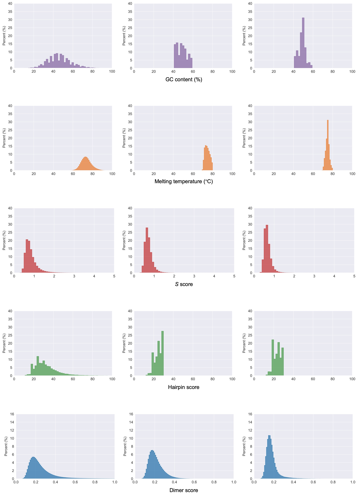
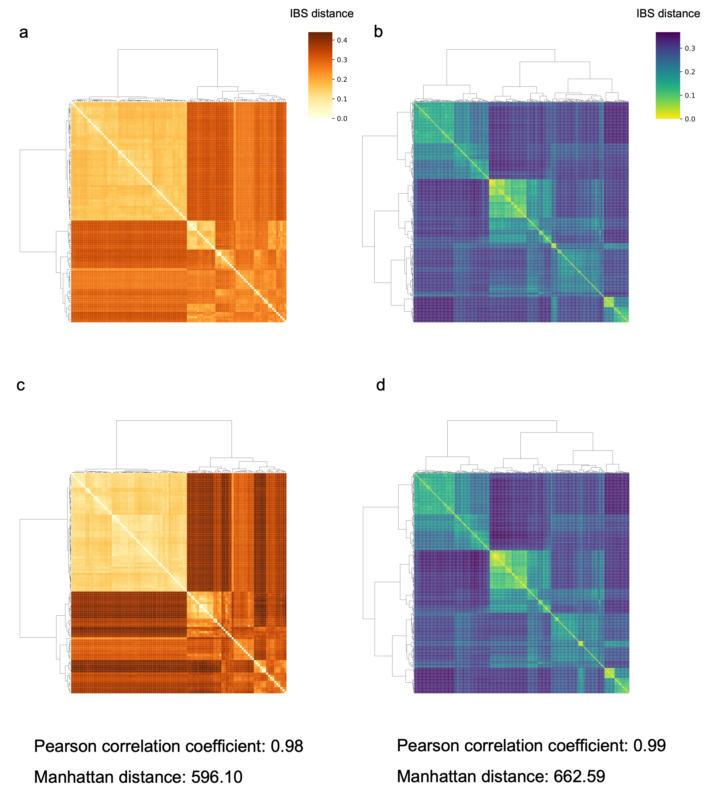
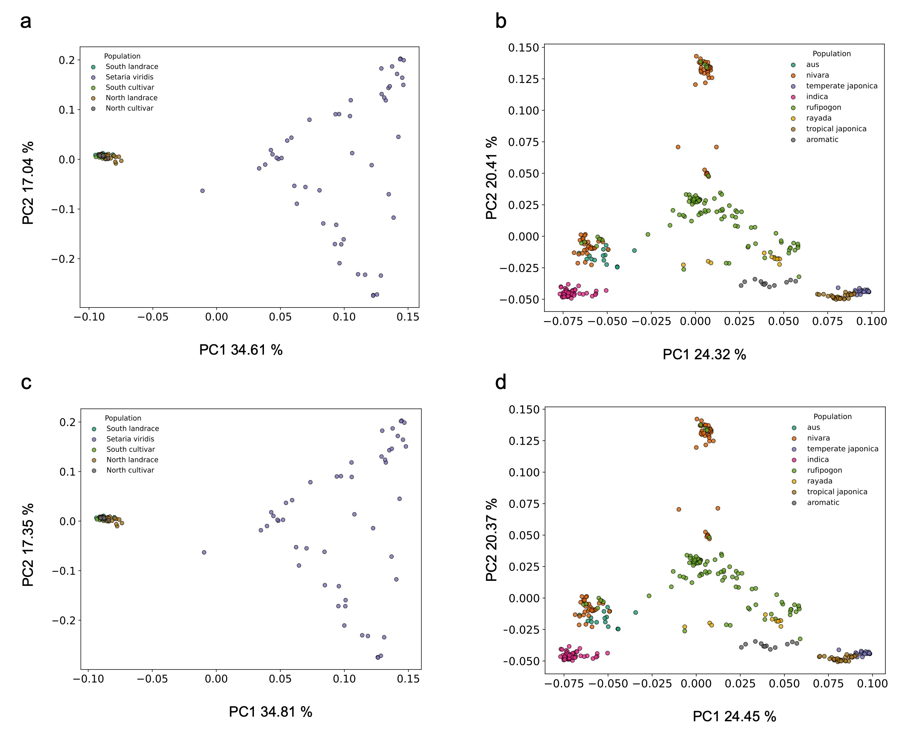
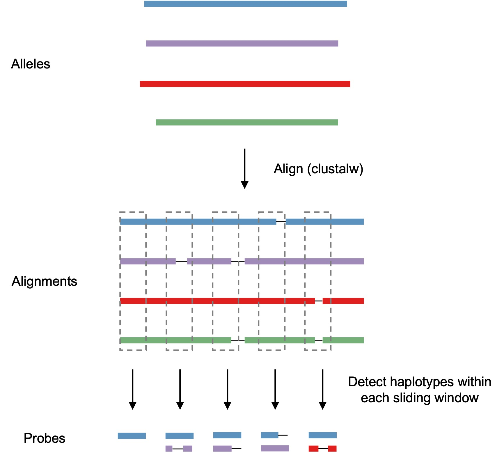

# *eProbe*: a one-stop capture probe design toolkit for genetic diversity reconstructions from ancient environmental DNA

This is the official repository for ***eProbe***, which is a python toolkit offering an efficient, flexible, and comprehensive end-to-end workflow for the generation, filtering, selection, and assessment of capture baits tailored for **ancient environmental DNA**, adaptable to any genomic landscape, from genome-wide informative loci to specific functional genes of interest. The core concept of this workflow involves 
1. Retrieve sequences that carry genetically informative variants.
2. Filtering for sequences that can be efficiently recovered from mixed environmental samples, meet suitable biophysical/biochemical criteria, and are reliable for subsequent analysis.
3. Evaluating the predicted performance of the sequences.
<div style="text-align: center;">
    
</div>

# Installation
The eProbes packages and environments can be managed using conda (https://docs.conda.io/en/latest/) .

## Installation using conda
under developing

```
upcoming
```

## Build eProbe from development version by cloning the github repo

```
git clone --recursive https://github.com/YCWangLab/eProbe
cd eProbe
python setup.py install
```
## Dependency
### Python and packages
```
python >= 3.8
biopython>=1.83
pysam>=0.22.0
pybedtools>=0.10.0
numpy>=1.24.4
pandas>=2.0.3

# for assessment
matplotlib>=3.7.5 
seaborn>=0.13.2
scipy>=1.10.1
fastcluster>=1.2.6
```
### Software
```
# for filtering
kraken2
bowtie2
samtools
bedtools

# for assessment
plink

# for generating probes with haplotype sequences  
shapeit>=5.1.0
bcftools>=1.18
clustal>=2.1
htslib >= 1.3
```

It is a bit annoying to deploy all these packages and software using conda right now, as they often conflict with each other. We are working on wrapping them into a conda environment. Before that, users may need to manually install some software or Python packages when conflicts arise and configure them into your `$PATH`.

# Data preparation

The first step in probe generation is to prepare a Variant Call Format (VCF) file representing genetic variations. This requires users to sample the genetic diversity of the species as comprehensively as possible to meet the needs of population genetic analysis. Below is a simple and fast pipeline for generating the input VCF file. The main software tools used are BWA, samtools, picard, bcftools, and vcftools.

### Step1
Map reads from all individual against reference genome

```
# Indexing genome
bwa index ref_genome.fasta -p genome 
# Mapping 
bwa mem -t 24 -M genome -R "@RG\tID:your_indiv_id\tPL:ILLUMINA\tSM:your_indiv_id" R1.fastq R2.fastq > indiv.sam 
# Sorting
samtools view -bhF 4 indiv.sam > indiv.F4.bam && samtools sort indiv.F4.bam > indiv.sorted.bam 
# Deduplicating
java -jar picard.jar MarkDuplicates I=indiv.sorted.bam O=indiv.dd.bam M=indiv.dd.metrics REMOVE_DUPLICATES=true
```


### Step2
Perform SNP-calling (Tips: This can be done seperately on different chromosomes and different regions, and finally use ```bcftools concat``` to merge them into a VCF)

```
bcftools mpileup --threads 24 --fasta-ref ref_genome.fasta ./*.dd.bam | bcftools call -mv --threads 24 -o bcftools_raw.vcf &
```


### Step3
Filter, compress, and index VCF.

```
# keep bi-allelic variants only
vcftools --vcf  bcftools_raw.vcf  --max-missing 0.80 --minDP 3 --maf 0.05 --mac 3 --minQ 30 --min-alleles 2 --max-alleles 2 --recode --recode-INFO-all --out MM80_filtered && bgzip -c MM80_filtered.recode.vcf > MM80.vcf.gz && tabix -p vcf MM80.vcf.gz &
```

### Step4 (optional)

We recommand users to conduct population genetic analyses with the VCF, such as phylogentic tree, PCA, admixture, site frequency spectrum, see whether it captures sufficient genetic diversity.


# Tutorial for running *eProbe*

*eProbe* generates two separate probe set panels tailored to specific research objectives and genomic regions of interest. The **POPGEN panel** targets bi-allelic SNPs for inferring population genetic history, undergoing filterings to evenly select optimal probes across genomes. Conversely, the **FUNCGEN panel** is designed to encompass functional genes and other genomic regions exempt from these filtering steps.

## POPGEN panel

**POPGEN panel** generation mainly based on a VCF file and corresponding reference genome file in FASTA format, involving **preprocessing**, **filtering**, **subsampling**, and **assessment**. We have prepared a test dataset (test_data) for new users, randomly selecting 100,000 bi-allelic SNPs on chr1-3, which were called from a rice dataset includes 320 accessions (details in supplementary note of *eProbe* paper).

## Step1: SNP preprocessor
The *SNP preprocessor* module (SNP_preprocessor.py) retrieves qualified SNPs from the VCF file (gz compressed and indexed). Users can input BED files to either retain or exclude SNPs (for example, SNPs called from repetitive regions). Then, based on user-defined criteria, SNPs clustered together are filtered out, as these highly variant regions might increase template (i.e., reference genome) bias of probes designed on them, reducing specificity when capturing non-template target sequences (i.e., other alleles).

```
python SNP_preprocessor.py -v vcf.gz -r ref_genome.fa --max_clump_snp 3 --cluster_flank 60 -t threads --keep_bed keep_bed --keep_distance -10 --remove_bed remove_bed --rm_distance 10
```
This command line extracts bi-allelic SNPs from VCF files (`-v vcf.gz`) and reference genome FASTA files (`-r ref_genome.fa`). It filters out SNPs that have more than two additional SNPs (`--max_clump_snp 3`) within a 60bp from both flanks (`--cluster_flank 60`), retains SNPs within the regions defined by `--keep_bed keep_bed` and contracts these regions inward by 10bp (`--keep_distance -10`), while removing SNPs in the regions defined by `--remove_bed remove_bed` expanded outward by 10bp (`--rm_distance 10`).
## Step2: SNP filter
The *SNP filter* module (SNP_filter.py) performs default filtering processes, including background noise filtering, accessibility filtering, taxonomic filtering, and biophysical/biochemical filtering.

**Background noise filtering:** Utilizes a kmer-based algorithm ([Kraken2](https://github.com/DerrickWood/kraken2/blob/master/docs/MANUAL.markdown)) to remove probes that overlap with sequences in user-defined background noise databases. Users can specify dominant species in environmental samples, such as microbes or dominant plants, to reduce DNA from these sources overly occupying probes.

**Accessibility filtering:** Filters out probes either in lineage-specific or repetitive genomic regions.

**Taxonomic filtering:** Retains probes that can be correctly assigned to the target species within allowable mismatch ranges, ensuring that sequences enriched in subsequent analyses can be reliably assigned to the target species.

**Biophysical filtering:** Filters probes based on GC content, melting temperature, complexity, and the likelihood of forming secondary structures.

```
python eProbe_SNP_filter.py -f SNPs_df.tsv (from step1) -r ref_genome.fa -t threads 
--BG_db Kraken2_database(s) --AC_db Bowtie2_database(s) --TX_db Bowtie2_database(s) --TX_acc2tax acc2taxid --TX_taxa taxon_id  --TX_names_dmp names.dmp --TX_names_dmp nodes.dmp
```
Kraken2_database(s) can be prepared using Kraken 2’s **kraken2-build** module (e.g., bacteria: kraken2-build --download-library bacteria --db bacteria). Bowtie2_database(s) for accessibility filtering can be prepared by bowtie2-indexing several high-quality assemblies from the same species or closely relative. Genomes for taxonomic filtering can be downloaded using **ncbi-genome-download** (doi: 10.5281/zenodo.8192432), and, the latest versions of the taxonomy files (names.dmp and nodes.dmp) were downloaded from NCBI (https://ftp.ncbi.nlm.nih.gov/pub/taxonomy/new_taxdump). Other details for preparing different databases can be found in supplementary note of *eProbe* paper

## Step3: SNP subsampler
The *SNP subsampler* module (SNP_subsampler.py) allows for uniform sampling of qualified SNPs from the genome based on user-defined window sizes. By default, the program randomly samples within the window. Users can set weights for different biophysical/biochemical features to select the optimal SNPs within the window, or input a BED file to prioritize SNPs within the BED regions. Users can also specify a certain number of SNPs based on practical application needs.
```
python SNP_subsampler.py -f SNPs_df.tsv (from step2) -r ref_genome.fa -t threads -o output --window_size 10000 --select_weights 0.2, 0.2, 0.2, 0.2, 0.2 --probe_number 1000
```
The command line select probes with optimal biophysical features from each non-overlapping 10kb (`--window_size 10000`) window of the genome. It applies selection weights (`0.2, 0.2, 0.2, 0.2, 0.2`) to choose the optimal probes (details in supplementary note of *eProbe* paper). Finally, the probe set is randomly downsized to 1,000 probes.

## Step4: SNP assessor
To date, the SNP assessor module (SNP_assessor.py) evaluates the final probe set from three aspects:
**Predicted performance in hybirdization capture:** Generates distribution plots of different biophysical/biochemical feature.

<div style="text-align: center;">
    
</div>


**Power in inferrence of population history:** Computes and compares pairwise IBS distances calculated based on original data and probe-covered SNPs. It visualizes distance matrices as heatmaps and hierarchical clustering, and computes matrix correlation and Manhattan distance.

<div style="text-align: center;">
    
</div>

**Tolerance to missing rate:** Simulates various degrees of missing data. It assesses the probe set's tolerance to missing data on genotyping.

<div style="text-align: center;">
    
</div>

##### Predicted performance in hybirdization capture

```1
python SNP_assessor.py -f SNPs_df.tsv (from step3) -r ref_genome.fa --assessor tag --tag all -o output
```
##### Power in inferrence of population history
```
python SNP_assessor.py -f SNPs_df.tsv (from step3) --vcf vcf.gz --assessor distance -o output
```
##### Tolerance to missing rate
```
python SNP_assessor.py -f SNPs_df.tsv (from step3) --vcf vcf.gz --assessor missing -o output
```

## Step5: SNP generator
The *SNP generator* module (SNP_generator.py) generates probes by specifying the length of the probes, the positions of SNPs on the probes, whether to replace SNPs with bases other than REF and ALT, and whether to retain only transversions (tv) or transition (ts) SNPs.
```
python SNP_generator.py -f SNPs_df.tsv (from step3) -r ref_genome.fa -t threads -o output --l 81 -s 0 --replace on 
```
The command line extracts 40 bp (`-l 81`) flanking each target SNP as probe sequences for synthesis. It centers the SNP (`-s 0`) within each probe, then substitutes the base at the SNP position with bases other than the reference (REF) and alternative (ALT) alleles (`--replace on`).

## FUNCGEN panel
## Seq generator
*eProbe* also allows users to input sequences of interest for probe generation. Users can input either a gene fasta file or a genome fasta file along with the positions where probes are needed (BED). Additionally, users can input a vcf file, and *Seq_generator.py* can estimate haplotypes (aka phase) on the regions in the BED file and obtain sequences of different alleles for probe design.

#### Generation with FASTA
```
python Seq_generator.py -f seq.fa -l 81 -s 30 --haplotyping on --sep '_' -o output
```
This command line generate FUNCGEN panel taking multi-FASTA format file as input. It uses a 81-bp windows with a 30-bp step to produre probe sequences across the whole gene. If different haplotypes/alleles (--haplotyping on) are provided (identified by _, for example, A_1 and A_2 are two alleles of gene A), the program will produre probe sequences considering all variants in windows.


#### Generation with BED
```
python Seq_generator.py -m bed -b bed_file -r ref_genome.fa --haplotyping on -v vcf.gz -l 81 -s 30 -o output
```
This command line generate FUNCGEN panel taking a BED file and corresponding reference genome file as input. Sequences will be extracted from reference genome and used as templates for sliding window generation. If a vcf.gz containing the variants of genes is provided and `--haplotyping on`, eProbe will estimate haplotype sequences by calling `phase_common` of ShapeIt (make sure the command can be found in your $PATH) and produre probes with them.
<div style="text-align: center;">
    
</div>

#### You are very wellcome to leave an issue if you have any question!
