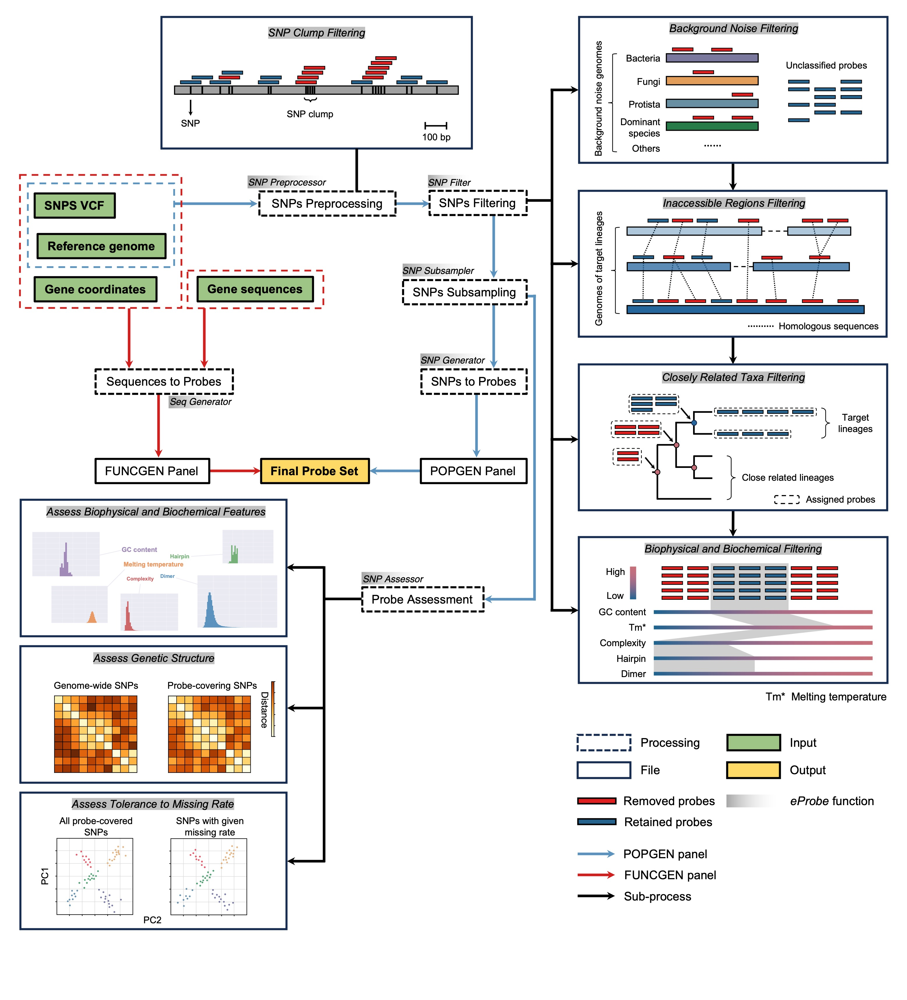

<div align="center">
  
</div>

# eProbe — Capture probe design toolkit for aDNA / eDNA

[](https://www.python.org/)
[](LICENSE)

**eProbe** is a command-line toolkit for designing capture hybridisation probes optimised for **ancient and environmental DNA** (aDNA / eDNA). It provides two fully automated probe-design panels plus a utility toolbox:

| Panel | Purpose |
|-------|---------|
| **popgen** | SNP-based probes for population-genetic inference (whole-genome) |
| **funcgen** | Sequence-based probes for functional genes / genomic regions of interest |
| **util** | Post-design tools: merge, tile, adapter, rename, assess, sample, target |

<div align="center">
  
</div>

---

## Installation

### pip (recommended)

```bash
pip install eprobe
```

### From source

```bash
git clone https://github.com/YCWangLab/eProbe
cd eProbe
pip install -e .
```

### External tools

Some filter and haplotyping steps require external tools.  
Run `eprobe info` to list all dependencies and check which ones are available in your `$PATH`.

| Tool | Required for |
|------|-------------|
| `samtools` / `bcftools` | VCF/BAM processing |
| `tabix` | VCF indexing |
| `bedtools` | BED region operations |
| `bowtie2` | Accessibility & taxonomic filtering |
| `kraken2` | Background-noise filtering |
| `shapeit5` | Haplotype phasing (`funcgen from-gff --phase`) |

---

## Quick start: POPGEN panel

Design SNP capture probes from a population VCF file.

```bash
# 1. Extract SNPs from a bgzipped, tabix-indexed VCF
eprobe popgen extract \
    -v population.vcf.gz \
    -r reference.fa \
    -o project/step1

# Outputs: project/step1.snps.tsv, project/step1.chr_sizes.tsv

# 2. Filter SNPs (biophysical, background, accessibility, taxonomic)
eprobe popgen filter \
    -i project/step1.snps.tsv \
    -r reference.fa \
    -o project/step2 \
    --BG_db /path/to/kraken2_db \
    --AC_db /path/to/bowtie2_index

# 3. Select one optimal SNP per genomic window
eprobe popgen select \
    -i project/step2.filtered.tsv \
    -o project/step3 \
    --window_size 10000 \
    --strategy weighted \
    --weights 0.2,0.2,0.2,0.2,0.2

# 4. Assess selected SNPs (biophysical + population-genetic quality)
eprobe popgen assess \
    -i project/step3.selected.tsv \
    --vcf population.vcf.gz \
    -o project/step4

# 5. Build probe FASTA from selected SNPs
eprobe popgen build \
    -i project/step3.selected.tsv \
    -r reference.fa \
    -o project/probes \
    --length 81 --snp_offset 0
```

Use `eprobe popgen <command> --help` for full option reference.

---

## Quick start: FUNCGEN panel

Design probes covering genes or genomic features.

### From a multi-FASTA file

```bash
# Simple tiling
eprobe funcgen from-fasta -f genes.fa -l 81 -s 30 -o probes

# Haplotype-aware (FASTA headers for the same gene share a common prefix
# separated by a user-defined character, e.g. GeneA_1 and GeneA_2)
eprobe funcgen from-fasta -f alleles.fa -l 81 -s 30 --haplotyping -o probes
```

### From BED regions

```bash
# Simple tiling from reference
eprobe funcgen from-bed -b regions.bed -r ref.fa -l 81 -s 30 -o probes

# Haplotype-aware (VCF required)
eprobe funcgen from-bed \
    -b regions.bed -r ref.fa \
    -v phased.vcf.gz \
    -l 81 -s 30 -o probes
```

### From GFF annotations

```bash
# Extract CDS probes for all genes
eprobe funcgen from-gff \
    -g annotation.gff -r ref.fa \
    --feature_type CDS \
    -l 81 -s 30 -o probes

# Target specific genes (by ID list file)
eprobe funcgen from-gff \
    -g annotation.gff -r ref.fa \
    --feature_type CDS \
    --gene_list genes_of_interest.txt \
    -l 81 -s 30 -o probes

# Haplotype-aware (phase with shapeit5)
eprobe funcgen from-gff \
    -g annotation.gff -r ref.fa \
    --feature_type CDS \
    -v population.vcf.gz --phase \
    -l 81 -s 30 -o probes
```

Output: `<output>.probes.fasta`

Use `eprobe funcgen <command> --help` for full option reference.

---

## Utility toolbox

```bash
eprobe util merge   -i a.fasta b.fasta -o merged        # merge + dedup
eprobe util tile    -f sequences.fa -l 81 -s 30 -o out  # tile FASTA
eprobe util adapter -f probes.fa --adapter5 ACGT -o out # add adapters
eprobe util rename  -f probes.fa --prefix MyProbe -o out
eprobe util assess  -f probes.fa --filter -o out        # biophysical QC
eprobe util sample  -f probes.fa -n 5000 -o out         # random sample
eprobe util target  -f probes.fa -r ref.fa -o out       # BED targets
```

---

## Pipeline runner

For reproducible multi-step runs, generate a config template and edit it:

```bash
eprobe init popgen -o popgen_config.yaml
eprobe run -c popgen_config.yaml
```

---

## Test data

A small test dataset is provided in `test_data/` (randomly sampled SNPs from a rice population dataset; chr1–3 only). See `test_data/README.md` for usage examples.

---

## Citation

> *Manuscript in preparation.* Please cite the GitHub repository until the paper is published.

---

## Issues & contributions

Bug reports and pull requests are welcome — please open an [issue](https://github.com/YCWangLab/eProbe/issues).
